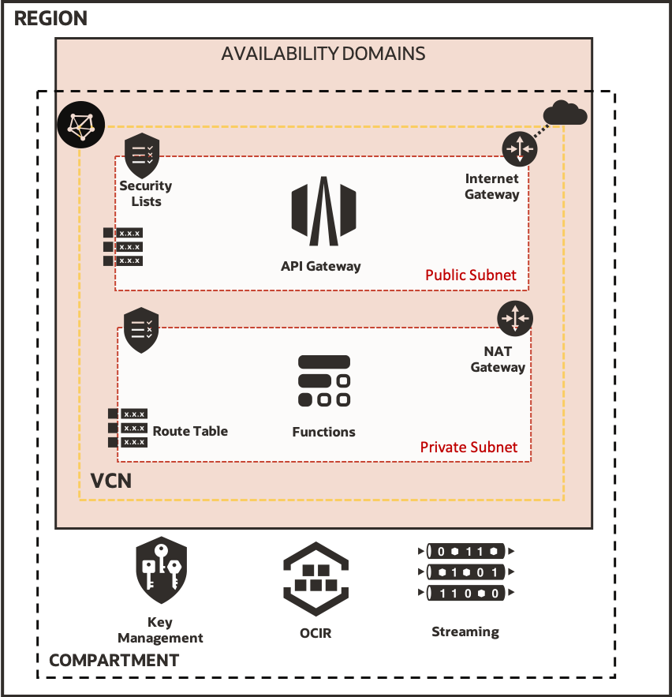

# Extending Oracle Blockchain Events with OCI

## Introduction

This repository is referenced from a series of Blog posts for extending Oracle Blockchain Platform with Oracle OCI Streams and functions [Extending Oracle Blockchain Events with OCI - Part 1 (Introduction)](https://www.ateam-oracle.com/extending-oracle-blockchain-events-with-oci-part-1-introduction)

This repository contains a set of terraform scripts that will provision the needed OCI environment to demonstrate the solution proposed in the blog post.

The scripts will provision the following services (Virtual Cloud Network ‘VCN’, Subnets, Route Tables, security Lists, Internet Gateway and NAT Gateway, Functions, API gateway, KMS) Below is the architectural diagram for the artifacts that will to be provisioned.



## Prerequisites

You need to follow the steps in [Part 3: Build the Oracle Functions "Event Producer"](https://www.ateam-oracle.com/extending-oracle-blockchain-events-with-oci-part-3-function-producer) in order to build the function docker image. The terraform scripts expects that docker image to be available in your region OCIR repo.

If you plan to use Oracle OCI Cloud Shell as explained in the blog post, you don't need to install any prerequisites, you can skip to Installation section. However if you plan to use your laptop, you need to have [Terraform](https://www.terraform.io/downloads.html) and [git](https://git-scm.com/downloads) installed.

## Installation

- Clone Code

    ```bash
    git clone
    ```

- Navigate to terraform directory

    ```bash
    cd terraform
    ```
- Edit file ***oci-obp-extension/terraform/terraform.tfvars*** and provide your account details.

- Initialize terraform project

    ```bash
    terraform init
    ```

- Execute terraform plan task to understand what components will be provisioned

    ```bash
    terraform plan
    ```

- Run terraform scripts

    ```bash
    terraform apply -auto-approve
    ```

## Contributing

`oci-obp-extension` is an open source project. See [CONTRIBUTING](CONTRIBUTING.md) for details.

Oracle gratefully acknowledges the contributions to `oci-obp-extension` that have been made by the community.
